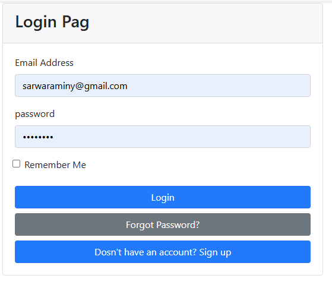
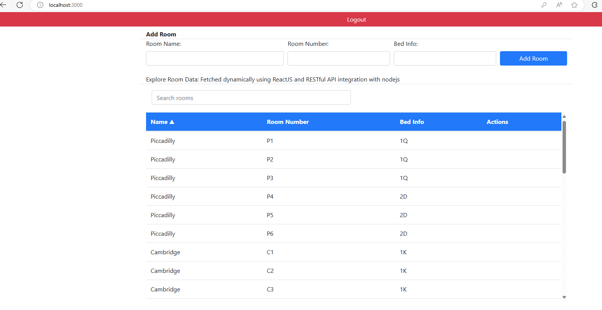
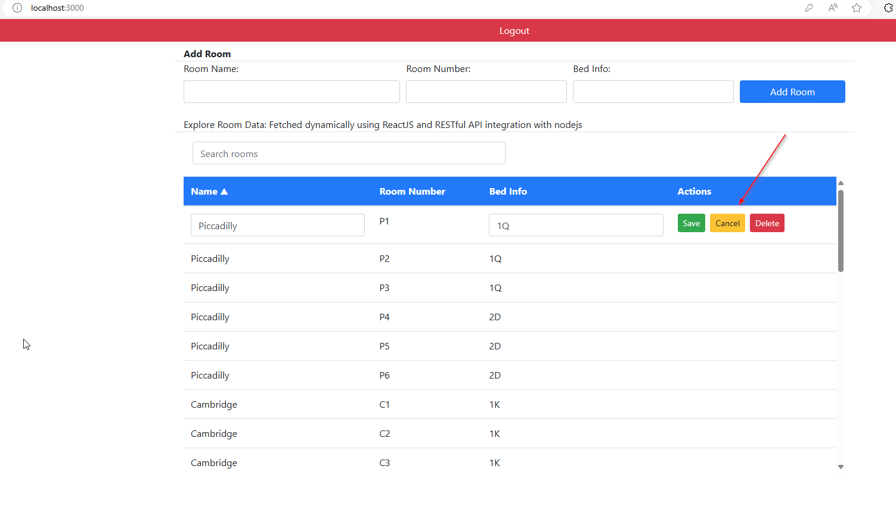

<h1>Room Management System</h1>

This project is a Room Management System that allows users to perform CRUD (Create, Read, Update, Delete) operations on room data. The system is built using Node.js, Express, React, PostgreSQL, Bootstrap, and JavaScript. It also includes authentication and registration functionalities.

 
<h2>Table of Contents</h2>

<ul><li><a target="_new" rel="noreferrer" href="#features">Features</a></li><li><a target="_new" rel="noreferrer" href="#technologies-used">Technologies Used</a></li><li><a target="_new" rel="noreferrer" href="#installation">Installation</a></li><li><a target="_new" rel="noreferrer" href="#usage">Usage</a></li><li><a target="_new" rel="noreferrer" href="#api-endpoints">API Endpoints</a></li><li><a target="_new" rel="noreferrer" href="#screenshots">Screenshots</a></li><li><a target="_new" rel="noreferrer" href="#contributing">Contributing</a></li><li><a target="_new" rel="noreferrer" href="#license">License</a></li></ul>
<h2>Features</h2> 
<ul><li><strong>User Authentication and Registration</strong></li><li><strong>Create, Read, Update, Delete (CRUD) operations for room data</strong></li><li><strong>Search and filter rooms</strong></li><li><strong>Sorting room data</strong></li><li><strong>Responsive design with Bootstrap</strong></li></ul>

<h2>Technologies Used</h2>
<ul><li><strong>Backend</strong>: Node.js, Express</li><li><strong>Frontend</strong>: React, JavaScript, Bootstrap</li><li><strong>Database</strong>: PostgreSQL</li><li><strong>Authentication</strong>: JSON Web Tokens (JWT)</li><li><strong>HTTP Client</strong>: Axios</li></ul>

<h2>Installation</h2>
<h3>Prerequisites</h3>
<ul><li>Node.js</li><li>PostgreSQL</li><li>NPM (Node Package Manager)</li></ul>

<h3>Backend Setup</h3>
<ol><li>
Clone the repository:
<pre>

<button class="flex gap-1 items-center"><svg xmlns="http://www.w3.org/2000/svg" width="24" height="24" fill="none" viewBox="0 0 24 24" class="icon-sm"><path fill="currentColor" fill-rule="evenodd" d="M7 5a3 3 0 0 1 3-3h9a3 3 0 0 1 3 3v9a3 3 0 0 1-3 3h-2v2a3 3 0 0 1-3 3H5a3 3 0 0 1-3-3v-9a3 3 0 0 1 3-3h2zm2 2h5a3 3 0 0 1 3 3v5h2a1 1 0 0 0 1-1V5a1 1 0 0 0-1-1h-9a1 1 0 0 0-1 1zM5 9a1 1 0 0 0-1 1v9a1 1 0 0 0 1 1h9a1 1 0 0 0 1-1v-9a1 1 0 0 0-1-1z" clip-rule="evenodd"></path></svg></button>

<code class="!whitespace-pre hljs language-bash">git clone https://github.com/yourusername/room-management-system.git
cd room-management-system
</code>

</pre></li><li>
Install backend dependencies:
<pre>

<button class="flex gap-1 items-center"><svg xmlns="http://www.w3.org/2000/svg" width="24" height="24" fill="none" viewBox="0 0 24 24" class="icon-sm"><path fill="currentColor" fill-rule="evenodd" d="M7 5a3 3 0 0 1 3-3h9a3 3 0 0 1 3 3v9a3 3 0 0 1-3 3h-2v2a3 3 0 0 1-3 3H5a3 3 0 0 1-3-3v-9a3 3 0 0 1 3-3h2zm2 2h5a3 3 0 0 1 3 3v5h2a1 1 0 0 0 1-1V5a1 1 0 0 0-1-1h-9a1 1 0 0 0-1 1zM5 9a1 1 0 0 0-1 1v9a1 1 0 0 0 1 1h9a1 1 0 0 0 1-1v-9a1 1 0 0 0-1-1z" clip-rule="evenodd"></path></svg></button>

<code class="!whitespace-pre hljs language-bash">cd backend
npm install
</code>

</pre></li><li>
Set up PostgreSQL database and configure environment variables in <code>.env</code> file:
<pre>

<button class="flex gap-1 items-center"><svg xmlns="http://www.w3.org/2000/svg" width="24" height="24" fill="none" viewBox="0 0 24 24" class="icon-sm"><path fill="currentColor" fill-rule="evenodd" d="M7 5a3 3 0 0 1 3-3h9a3 3 0 0 1 3 3v9a3 3 0 0 1-3 3h-2v2a3 3 0 0 1-3 3H5a3 3 0 0 1-3-3v-9a3 3 0 0 1 3-3h2zm2 2h5a3 3 0 0 1 3 3v5h2a1 1 0 0 0 1-1V5a1 1 0 0 0-1-1h-9a1 1 0 0 0-1 1zM5 9a1 1 0 0 0-1 1v9a1 1 0 0 0 1 1h9a1 1 0 0 0 1-1v-9a1 1 0 0 0-1-1z" clip-rule="evenodd"></path></svg></button>

<code class="!whitespace-pre hljs language-bash">DB_USER=your_db_user
DB_PASSWORD=your_db_password
DB_HOST=your_db_host
DB_PORT=your_db_port
DB_DATABASE=your_db_name
JWT_SECRET=your_jwt_secret
</code>

</pre></li><li>
Run the backend server:
<pre>

<button class="flex gap-1 items-center"><svg xmlns="http://www.w3.org/2000/svg" width="24" height="24" fill="none" viewBox="0 0 24 24" class="icon-sm"><path fill="currentColor" fill-rule="evenodd" d="M7 5a3 3 0 0 1 3-3h9a3 3 0 0 1 3 3v9a3 3 0 0 1-3 3h-2v2a3 3 0 0 1-3 3H5a3 3 0 0 1-3-3v-9a3 3 0 0 1 3-3h2zm2 2h5a3 3 0 0 1 3 3v5h2a1 1 0 0 0 1-1V5a1 1 0 0 0-1-1h-9a1 1 0 0 0-1 1zM5 9a1 1 0 0 0-1 1v9a1 1 0 0 0 1 1h9a1 1 0 0 0 1-1v-9a1 1 0 0 0-1-1z" clip-rule="evenodd"></path></svg></button>

<code class="!whitespace-pre hljs language-bash">npm start
</code>

</pre></li></ol>

<h3>Frontend Setup</h3>
<ol><li>
Navigate to the frontend directory and install dependencies:
<pre>

<button class="flex gap-1 items-center"><svg xmlns="http://www.w3.org/2000/svg" width="24" height="24" fill="none" viewBox="0 0 24 24" class="icon-sm"><path fill="currentColor" fill-rule="evenodd" d="M7 5a3 3 0 0 1 3-3h9a3 3 0 0 1 3 3v9a3 3 0 0 1-3 3h-2v2a3 3 0 0 1-3 3H5a3 3 0 0 1-3-3v-9a3 3 0 0 1 3-3h2zm2 2h5a3 3 0 0 1 3 3v5h2a1 1 0 0 0 1-1V5a1 1 0 0 0-1-1h-9a1 1 0 0 0-1 1zM5 9a1 1 0 0 0-1 1v9a1 1 0 0 0 1 1h9a1 1 0 0 0 1-1v-9a1 1 0 0 0-1-1z" clip-rule="evenodd"></path></svg></button>

<code class="!whitespace-pre hljs language-bash">cd frontend
npm install
</code>

</pre></li><li>
Configure environment variables in <code>.env</code> file:
<pre>

<button class="flex gap-1 items-center"><svg xmlns="http://www.w3.org/2000/svg" width="24" height="24" fill="none" viewBox="0 0 24 24" class="icon-sm"><path fill="currentColor" fill-rule="evenodd" d="M7 5a3 3 0 0 1 3-3h9a3 3 0 0 1 3 3v9a3 3 0 0 1-3 3h-2v2a3 3 0 0 1-3 3H5a3 3 0 0 1-3-3v-9a3 3 0 0 1 3-3h2zm2 2h5a3 3 0 0 1 3 3v5h2a1 1 0 0 0 1-1V5a1 1 0 0 0-1-1h-9a1 1 0 0 0-1 1zM5 9a1 1 0 0 0-1 1v9a1 1 0 0 0 1 1h9a1 1 0 0 0 1-1v-9a1 1 0 0 0-1-1z" clip-rule="evenodd"></path></svg></button>

<code class="!whitespace-pre hljs language-bash">REACT_APP_SERVER_ADDRESS=http://localhost:8000
</code>

</pre></li><li>
Run the frontend development server:
<pre>

<button class="flex gap-1 items-center"><svg xmlns="http://www.w3.org/2000/svg" width="24" height="24" fill="none" viewBox="0 0 24 24" class="icon-sm"><path fill="currentColor" fill-rule="evenodd" d="M7 5a3 3 0 0 1 3-3h9a3 3 0 0 1 3 3v9a3 3 0 0 1-3 3h-2v2a3 3 0 0 1-3 3H5a3 3 0 0 1-3-3v-9a3 3 0 0 1 3-3h2zm2 2h5a3 3 0 0 1 3 3v5h2a1 1 0 0 0 1-1V5a1 1 0 0 0-1-1h-9a1 1 0 0 0-1 1zM5 9a1 1 0 0 0-1 1v9a1 1 0 0 0 1 1h9a1 1 0 0 0 1-1v-9a1 1 0 0 0-1-1z" clip-rule="evenodd"></path></svg></button>

<code class="!whitespace-pre hljs language-bash">npm start
</code>

</pre></li></ol>

<h2>Usage</h2><ol><li>Register a new user account.</li><li>Log in with the registered account.</li><li>Perform CRUD operations on room data:<ul><li>Create a new room</li><li>View the list of rooms</li><li>Update room details</li><li>Delete a room</li></ul></li><li>Use the search functionality to filter rooms.</li><li>Click on column headers to sort the room data.</li></ol><h2>API Endpoints</h2><h3>Authentication</h3><ul><li><strong>POST</strong> <code>/signup</code>: Register a new user</li><li><strong>POST</strong> <code>/login</code>: Log in a user</li></ul><h3>Rooms</h3><ul><li><strong>GET</strong> <code>/rooms</code>: Retrieve a list of all rooms</li><li><strong>POST</strong> <code>/room/add</code>: Add a new room</li><li><strong>PUT</strong> <code>/room/edit/:roomNumber</code>: Update room details by room number</li><li><strong>DELETE</strong> <code>/room/delete/:roomNumber</code>: Delete a room by room ID</li></ul>
<h2>Screenshots</h2><h3>Login Page</h3><h3>Room List</h3><h3>Edit Room</h3><h2>Contributing</h2><ol><li><strong>Fork the repository</strong></li><li><strong>Create your feature branch (<code>git checkout -b feature/fooBar</code>)</strong></li><li><strong>Commit your changes (<code>git commit -am 'Add some fooBar'</code>)</strong></li><li><strong>Push to the branch (<code>git push origin feature/fooBar</code>)</strong></li><li><strong>Create a new Pull Request</strong></li></ol><h2>License</h2>
This project is licensed under the MIT License - see the <a target="_new" rel="noreferrer">LICENSE</a> file for details.
